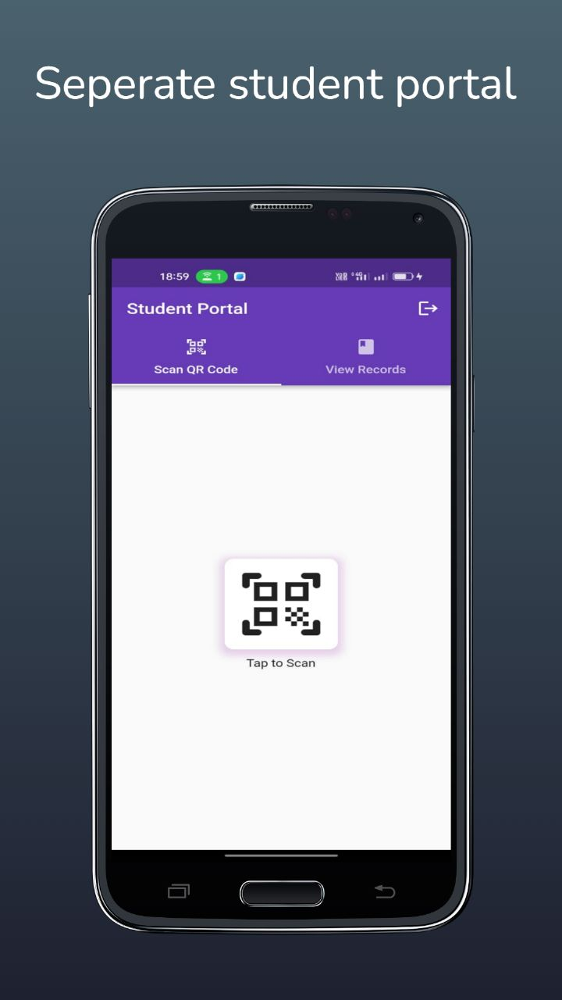
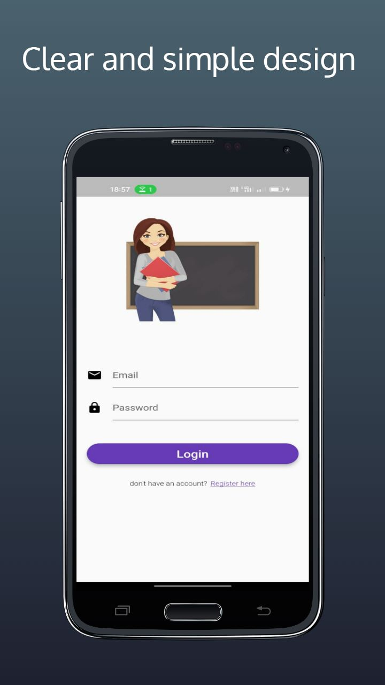
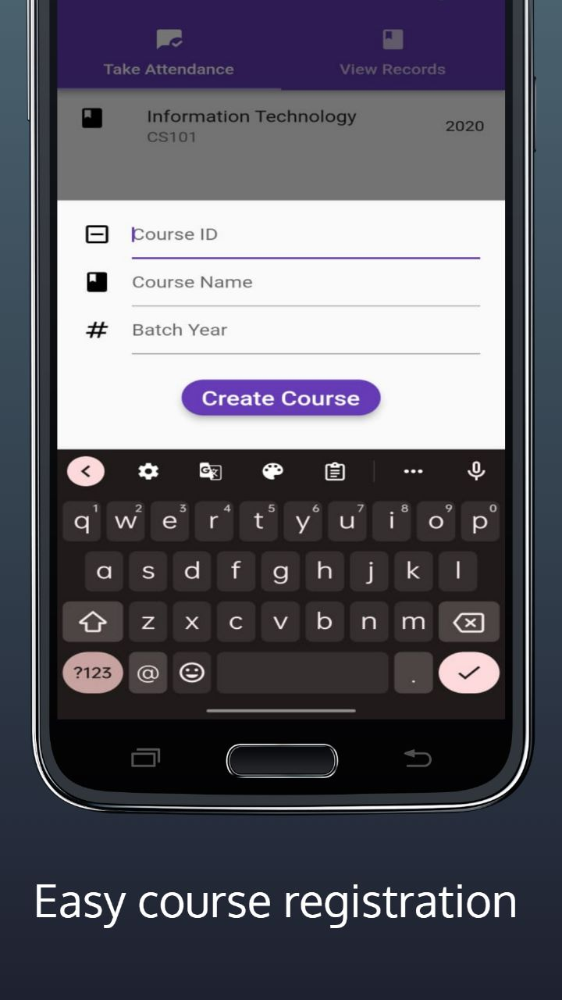
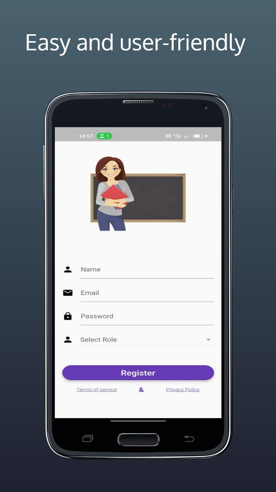
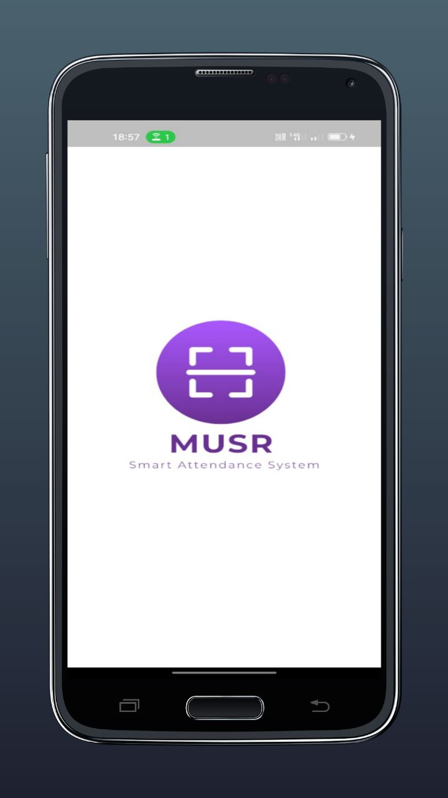
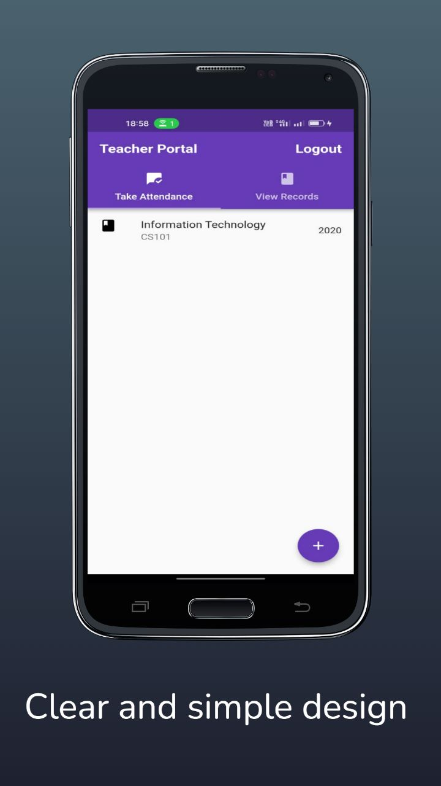
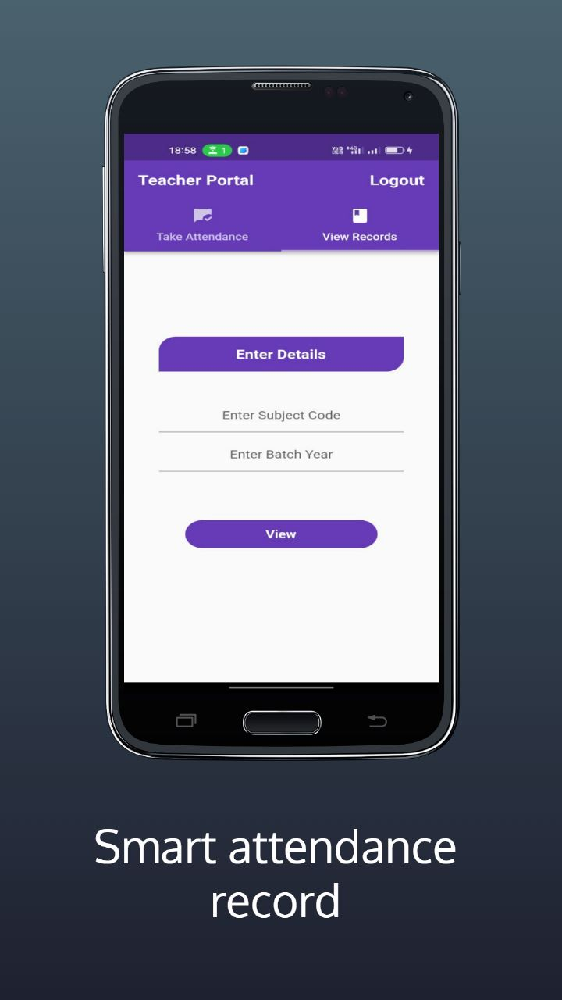

# 
MUSR, The Smart Attendance Software

  
# Table of Contents
[Introduction](#introduction)  

[Features](#paragraph1)

[Utilisation](#paragraph2)

[Developer's Note](#paragraph3)

[Contact](#paragraph4)

## INTRODUCTION
a software which enables a user to scan a QR for attendance which changes after every scan   
sorry no more proxy now

## FEATURES 
 

dynamic QR Geneator
easy course creation  
export data in excel spreadsheet    
seperate student and faculty portal  
simple UI for a hassel free experience 
free of cost

availaible on google play

## UTILISATION  
developed focusing and addressing the ease of automated attendance in academic as well as non academic institutions with a future vision to expand its scope to user record maintainance
## DEVELOPER'S NOTE  
 Hello World !! I am Suraj Kumar, a CSE undergraduate and a passionate full-stack developer. Well the pain of B.Tech students coming to boring lectures for attendance and professers not willing to take one for such a large number of students had motivated me for this one stop solution. This is how my journey with MUSR has started and I look forward to people joining me with their valuable suggestions. 

## CONTACT 
Reach out to me at surajverma2910@gmail.com or on the below links  
[ LinkedIn](https://www.linkedin.com/in/suraj-kumar-3937b6173/)
&nbsp;
[ GitHub](https://github.com/)

